# Analysis of data computed using Feret's diameter

Shape description is a field of image analysis that deals with the quantification of shape properties of an object. A shape property that is quantified by a number is named descriptor. For instance, area, perimeter and diameter are some descriptors. Many shape descriptors are generic, i.e. they are used for computing other descriptors using mathematical operations. In such a manner a generic feature can be transformed into another, derived, feature. It is interesting that a generic feature and a derived feature based on it can have different geometrical meanings and it is itricate to make clear and general conclusions abouts the relationship of the geometrical meanings.  

Feature selection is an important and complex problem in data analysis and machine learning tasks. Having at disposal a large number of features, it is of crucial importance to select the most suitable. Some benefits are reducing the computational time and avoiding overfitting and learning based on irrelevant features. An explanatory example is that it is important for problems of prediction using regresssion that we use features which strongly affect the value we want to predict but are uncorrelated to each other.

Many different descriptors are used simultanelusly in shape analysis to provide a set of numbers that determines the shape of an object as best as possible. Naturally arrises an interesting question: How would descriptors derived from a same generic behave in data analysis and machine learning tasks. One of the generic descriptors is Feret's diameter and this is a small study on it.

### Feret's diameter

Feret's diameter of an object is the distance between its two furthest points measured in a given direction. For an illustration, we give the following image:

  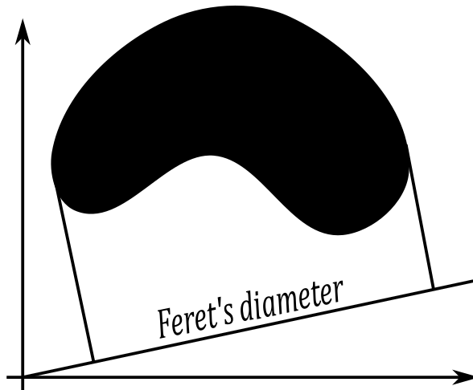

When computed for multiple directions, Feret's diameter enables a number of other shape descriptors. For this study we choose the following:
1. *Maximal Feret's diameter* - equal to the classic diameter, i.e. the distance between two futhest points of an object. We compute it as the maximal Feret's diameter over all the directions.
2. *Minimal Feret's diameter* - minimal Feret's diameter over all the directions.
3. *Aspect ratio* - ratio between maximal and minimal Feret's diameter.
4. *Average Feret's diameter* - average Feret's diameter over all the directions.
5. *Feret's diameter perpendicular to the maximal*.
6. *Feret's diameter perpendicular to the minimal*.
7. *Area of the minimal encasing rectangle* - the area of the rectangle with minimal area among all the rectangles that encase the object.
8. *Larger side of the minimal encasing rectangle*.
9. *Shorter side of the minimal encasing rectangle*.
10. *The radius of the ball with equal volume as the cylinder with radius equal to minimal Feret's diameter and height equal to maximal Feret's diameter*.
11. *Perimeter* - computed as the average Feret's diameter over all directions multiplied by π. This can be applied only if the observed shapes are convex, which is true in our case.

### Input data

Pixel coverage representation is the representation of a shape in which image intensities express to which extent every pixel is covered by the shape. There are different methods for computing pixel coverage representation from real images. We use the algorithm proposed in https://doi.org/10.1016/j.patrec.2011.12.014. The input data base is Matlab cell array [FerDiamAllCellAng/coverSegm.mat](FerDiamAllCellAng/coverSegm.mat) consisting of 368 pixel coverage representations of microscopic images of cell nuclei. The following image illustrates some cell nuclei from the data base and their pixel coverage representations:

  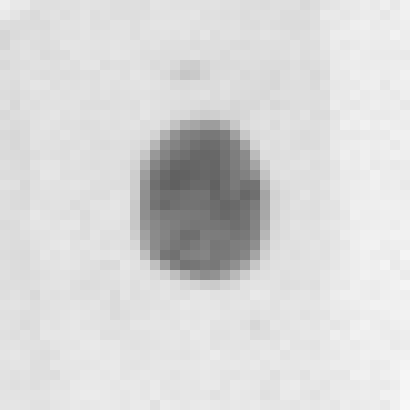
  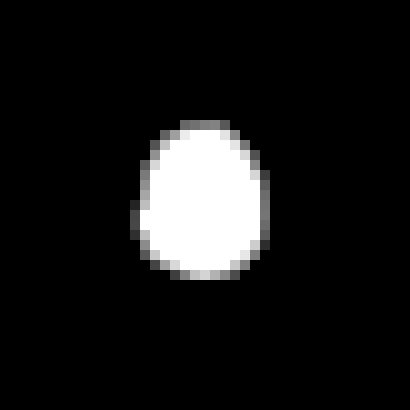
  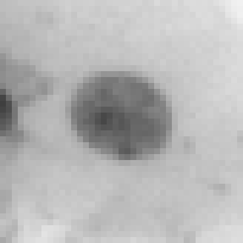
  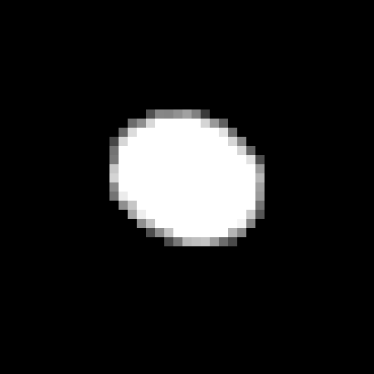

### Computing Feret's diameter over angles and cells

[FerDiamAllCellAng/cellMain.m](FerDiamAllCellAng/cellMain.m) iterates over angles {0,1,2...,180} degrees and computes Feret's diameter for every cell using the algorithm proposed in https://doi.org/10.1016/j.patrec.2016.04.021. Some cells and the computed Feret's diameter are illustrated in the following figure:

  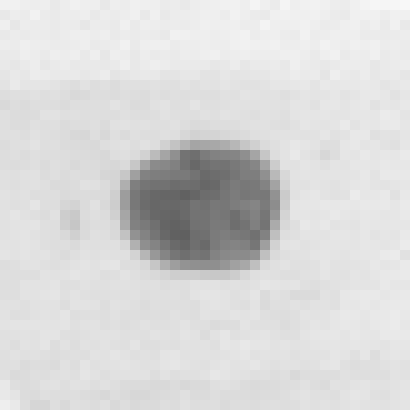
  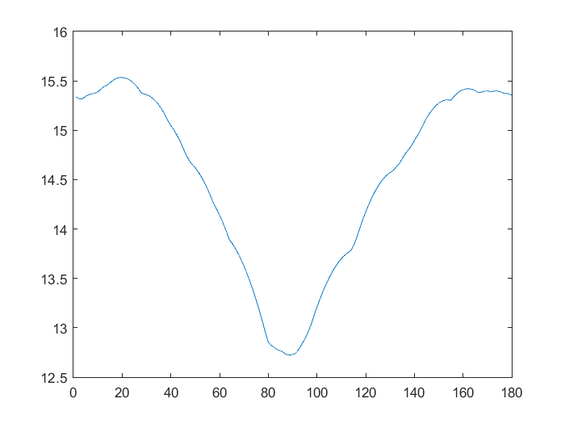
  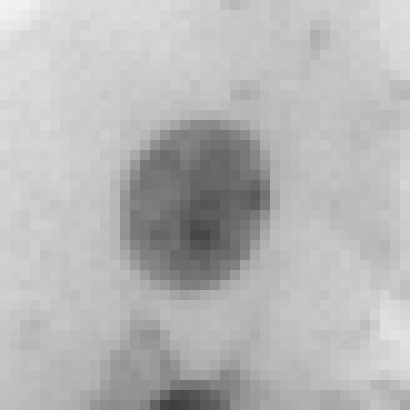
  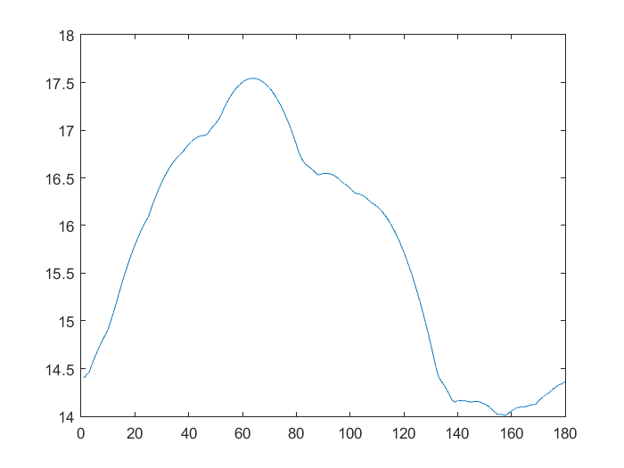

[descAnVis/allCellsAngFerVis.py](descAnVis/allCellsAngFerVis.py) visualizes the result over all cells and angles: 

  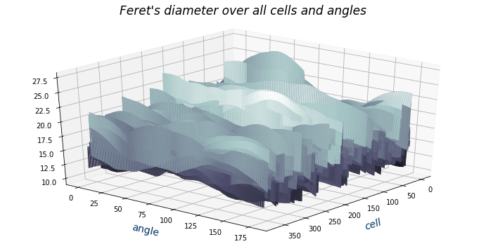

### Computing other descriptors

Using the obtained matrix ( [descAnVis/widthAllCells.mat](descAnVis/widthAllCells.mat) ) of Feret's diameter over all cells and angles [descAnVis/descCompAndVis.py](descAnVis/descCompAndVis.py) computes and visualizes values of the descriptors we listed in the section **Feret's diameter**.

We illustrate some of the descriptors over all the cells in the data base:

  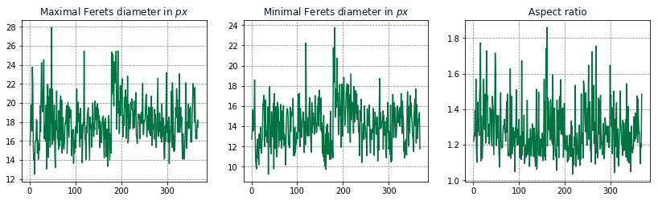

### Computing correlation matrix

[descAnVis/correlMatrix.py](descAnVis/correlMatrix.py) computes the correlation matrix and displays the heat map for the 11 descriptors:

  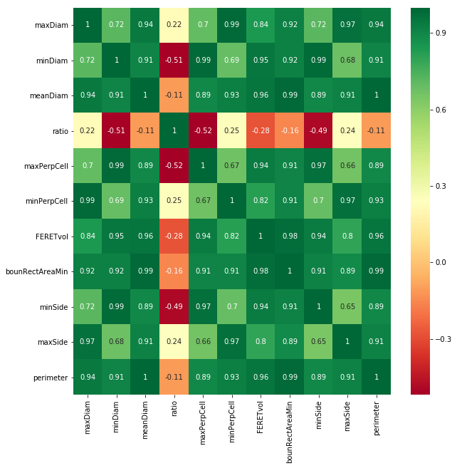

### Conclusion

A general conclusion is that there is a high positive correlation between the descriptors computed on the data set, with the exception of the aspect ratio. However, the features that turn out to be correlated on this data set are not neccesarily correlated in general. For instance, it would be possible that the perimeter increases without increaing the shape size related to inceasing encasing rectangle, maximal and minimal diameter if the shapes in the data set are not all convex. 

It is interesting to notice that the perimeter is more strongly correlated to the area of the bounding rectangle than to the maximal diameter. This can be explained by the fact that an increment of the maximal diameter does not neccesarily leads to an increment of the perimeter since a shape can be elongated. On this data base both, the bounding rectangle and the perimeter are measures of the size of a shape.

A high correlation between the maximal and minimal diameter indicates the uniformity of shapes in the data set. The shapes vary in their size and an increment of maximal and minimal diameter increases the size. This is not true for the aspect ratio. The aspect ratio measure decreases with increasing the minimal diameter, i.e. size. 

My general impression is that the computed measures with exceptance of the aspect ratio have strong positive correlation to the size of shapes in the data set. If we wolud observe more diverse objects which change their convexity, elongation, compactness and other properties, the results would differ. One more impression is that understanding of what features at disposal represent for the data under consideration is of great importance for selecting the right features and making generalizaions of conclusions to larger data sets.  

Any more conclusions :) ?

